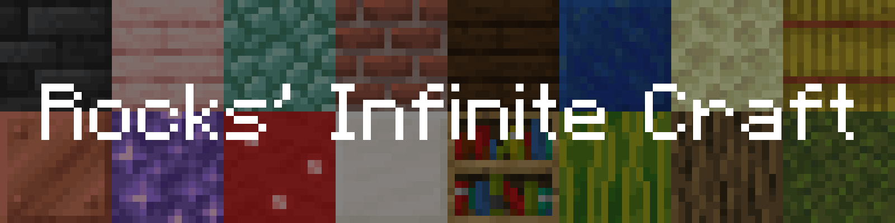
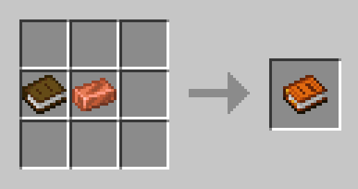
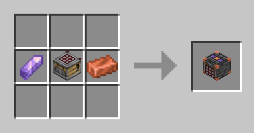

# Rocks' Infinite Craft

<p>
  <a href="https://github.com/Rhgx/rocks-infinite-craft/releases/latest"></a>
  <a href="https://fabricmc.net/use/installer/"></a>
  <a href="https://adoptium.net/temurin/releases/?version=25"></a>
</p>

Drop two items. Discover something new.

An Infinite Craft-inspired Fabric mod for Minecraft 26.2.

## What you can do

- Discover new combinations, some with custom names, traits, enchantments, and potion effects.
- Browse the Discovery Book, share recipes in chat, and reach world discovery milestones.
- Tune item strength, silliness, which items count as special, sounds, and particles.

Works with Ollama, Codex CLI, OpenAI, Anthropic, Gemini, OpenRouter, and compatible APIs.

Recipes are saved per world. Repeating a combination reuses its result instead of making another model request. The item catalog comes from the game's registry, including installed mods.

## Get started

1. Install **Java 25**, **Fabric Loader 0.19.5+**, and **Fabric API for Minecraft 26.2**.
2. Put the mod JAR in the host's `mods` folder.
3. To get the in-game settings screen, install **Cloth Config** and **Mod Menu**. Open **Mods > Rocks' Infinite Craft > Configure**.
4. Choose your provider and model, test the connection, then enable recipe generation.
5. Run `/fusion enable`, then drop two items next to each other, one at a time. Two of the same item work too.

The host toggles fusion, and the setting persists per world. By default, everyone gets a soulbound Discovery Book while fusion is enabled. Switch **Book ownership** to **Craftable** to use a book + copper ingot recipe instead; crafted books can be dropped and have no vanishing curse. **Book visibility** can be **Global** or **Personal**, showing only recipes you have made in personal mode.

Vanilla guests do not need the mod, though installing it is recommended for the best experience.

Hosted providers may charge for requests. API keys are stored in the host's local configuration.

## Crafting recipes

Both recipes are shapeless, so the items can go anywhere in the crafting grid.

### Discovery Book



### Fusion Crafter



## Documentation

- [Provider setup](docs/providers.md)
- [Settings and gameplay reference](docs/configuration-reference.md)
- [Catalog and custom recipes](docs/catalog.md)
- [Recipe storage](docs/engine.md)
- [Adding a trait](docs/adding-a-trait.md)
- [Testing](docs/testing.md)

## Build and release

With Java 25 installed:

```sh
./gradlew build
```

On Windows, use `./gradlew.bat build`. JARs are written to `build/libs/`.

GitHub Actions builds and tests each push and pull request. Releases use the tag's version, are named **RIC <version>**, and include the mod and source JARs. [Download the latest release](https://github.com/Rhgx/rocks-infinite-craft/releases/latest).

## License

Licensed under [GPLv3](LICENSE). Third-party textures and logos retain their respective licenses.

## Credits

Inspired by [Infinite Craft](https://neal.fun/infinite-craft/) and [ExclusivertMods' original Minecraft mod](https://github.com/ExclusivertMods/Infinite-Craft-Java). Minecraft block textures belong to Mojang. Provider logo sources and licenses are listed in [provider icons](docs/provider-icons/README.md).
